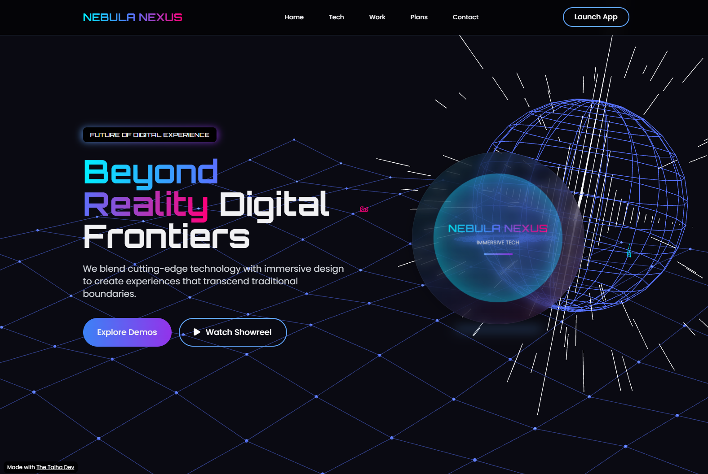

# 3D Creative Agency Website

An immersive 3D creative agency landing page built using **HTML**, **CSS**, and **JavaScript** — enhanced with smooth animations and interactive transitions.

## ✨ Features

- Modern agency landing page layout
- 3D-style hero section
- Smooth entrance animations
- Responsive design for all devices
- Scroll-triggered transitions
- Glassmorphism / Neumorphism styles (if used)
- Optional: GSAP or Three.js powered effects

## 🛠️ Tech Stack

- HTML5
- CSS3 (Grid, Flex, Animations)
- Vanilla JavaScript  
*(Optional: GSAP / Three.js if used)*

## 🖼️ Screenshot

*(Add screenshots or preview GIFs here)*

## 🧠 Learning Outcomes

- UI/UX design structure
- Frontend animations
- Interactive element control
- Real-world agency layout mimic

## 📁 Project Structure

/3d-agency-website
├── index.html
├── style.css
└── script.js

## 👨‍💻 Created By

**TheTalha-Dev** — MERN Stack Developer | Frontend & 3D UI Explorer

---

*Clone, remix, or showcase in your portfolio — this is where code meets creativity.*
